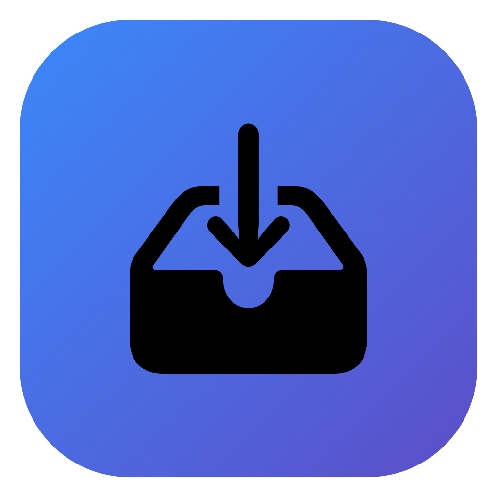

<p align="center">
  
</p>

<h1 align="center">Quick Drop Zone</h1>

<p align="center">A careful, local-first file organizer in the macOS menu bar.</p>

<p align="center"><a href="https://github.com/9phfr6dsw4-dotcom/quick-drop-zone/releases/latest"><strong>Download the latest release</strong></a> · macOS 26+</p>

## Features

- Drop a file into the menu-bar popover, review the reason, then explicitly choose a destination. Uncertain files stay unsorted.
- Extension rules are followed exactly. Local learning suggests a destination only after at least three distinct same-extension examples share a meaningful subject. Screenshot detection checks local capture metadata.
- Cleanup reviews visible top-level files in Downloads or a folder you choose. New-folder groups start unchecked and are created only after approval.
- Trash suggestions are separate and unchecked. Only a `.dmg` directly in Downloads with its matching `.app` directly in `/Applications` can be moved to macOS Trash; files are never permanently deleted.
- Undo the latest move.
- No file contents are read, and Quick Drop Zone has no networking or analytics.

## Install

1. Download the ZIP from the latest release and unzip it.
2. Move **Quick Drop Zone.app** to **Applications before opening it**.
3. Open it once. If macOS blocks it, go to **System Settings → Privacy & Security → Open Anyway**, confirm, then reopen the app from Applications.
4. Click the app’s tray-and-arrow icon in the menu bar. Choose folders through the app when adding favorites or reviewing files.

The release is ad-hoc signed and not notarized. No Full Disk Access permission is needed; folder access is granted through the folders you choose in the app.

## Privacy

Preferences, learned filename patterns, names, and screenshot metadata stay on your Mac. The app does not read file contents or send files, filenames, or metadata to an online service. Uncertain suggestions are not sent to an AI service or used as a destination fallback.

<details>
<summary>Build and test</summary>

Requires Xcode with the macOS 26 SDK.

```sh
swift test
bash Scripts/package-app.sh
bash Scripts/smoke-test.sh
```

</details>

<details>
<summary>Maintainer release checklist</summary>

1. Wait for the macOS CI run to pass.
2. Download its ZIP and SHA-256 sidecar, then verify the checksum and extracted app.
3. Attach those exact files to the versioned GitHub Release. Do not rebuild after verification.
4. Download the public ZIP and confirm it matches the CI checksum.

</details>
